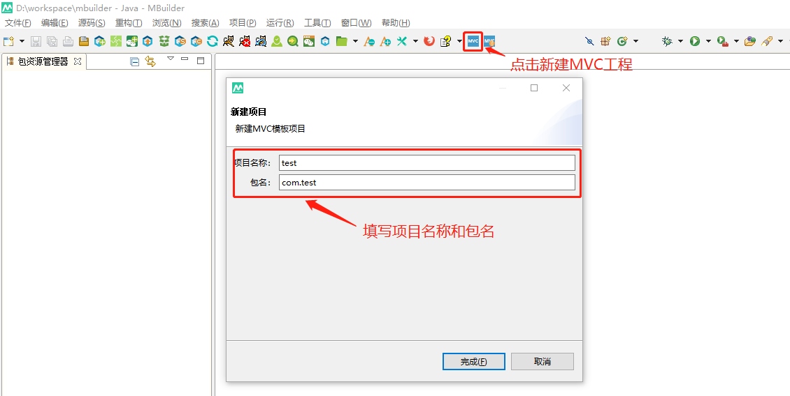
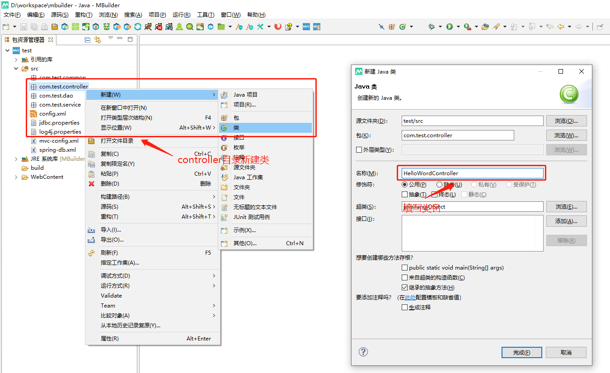
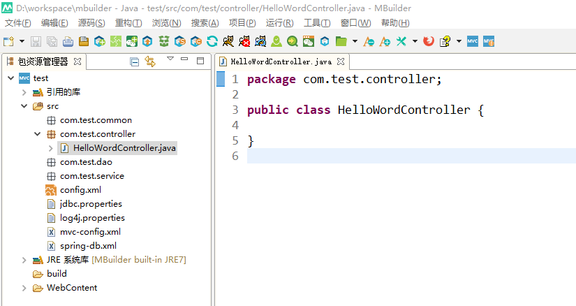
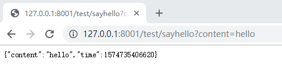

### 1.2 Mbuilder进行SpringMVC服务开发

#### 1.2.1 创建工程

1. 打开Mbuilder，点击新建MVC工程，填写项目名和包路径



#### 1.2.2 HelloWord服务示例

1. 在controller目录新建类HelloWordController



2. 编辑HelloWordController.java



```java
package com.test.controller;

import java.util.HashMap;
import java.util.Map;

import org.apache.ibatis.annotations.Param;
import org.springframework.stereotype.Controller;
import org.springframework.web.bind.annotation.RequestMapping;

@Controller
public class HelloWordController {
	@RequestMapping("/sayhello")
    @ResponseBody
	public Object sayHello(@Param("content") String content) {
		Map<String, Object> reMap = new HashMap<>();
		reMap.put("time", System.currentTimeMillis());
		reMap.put("conten", content);
		return reMap;
	}
}
```

#### 1.2.3 运行工程


#### 1.2.4 接口访问测试

浏览器打开地址： http://127.0.0.1:8001/test/sayhello?content=hello 



#### 1.2.5 调试代码

1. 设置Mbuilder打开调试模式（窗口->首选项->Exmobi->勾选“在调试模式下启动Exmobi开发模拟器”），重启服务


2. 设置断点并访问接口


#### 1.2.6 导出war包用户Exmobi后台上传服务

