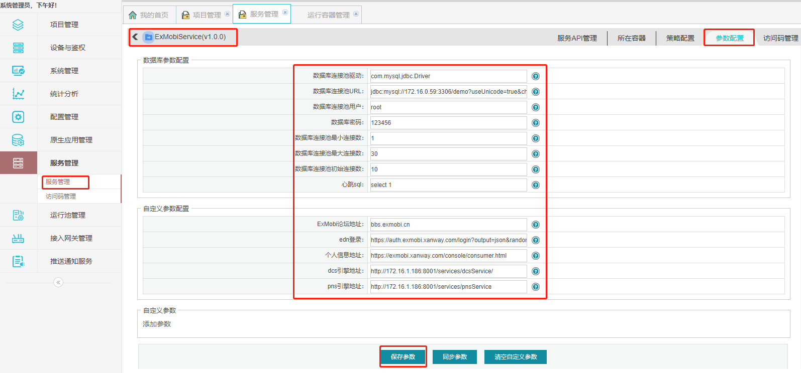

### 3.4 服务配置管理

​		SpringMVC服务测试环境和生产环境的配置是不一样的，例如测试环境连接的数据库和生产环境的连接的数据库是不同的，服务配置管理修改相关配置，而不需要通过war中的配置文件来达到相关目标。

1. 点击“服务管理”，点击需要进行参数配置的服务，点击参数配置

2. 根据实际情况进行参数配置

3. 点击“保存参数”进行参数保存， 点击“同步参数”将配置同步到在容器中允许的服务