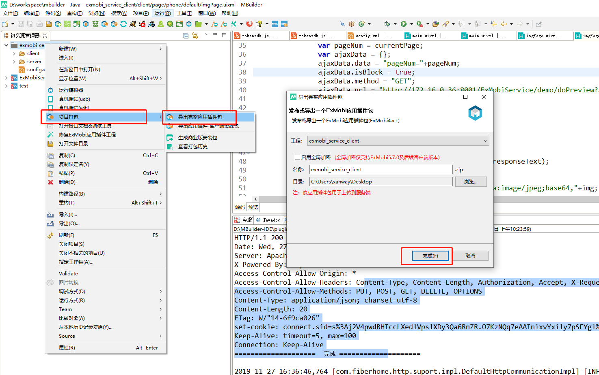
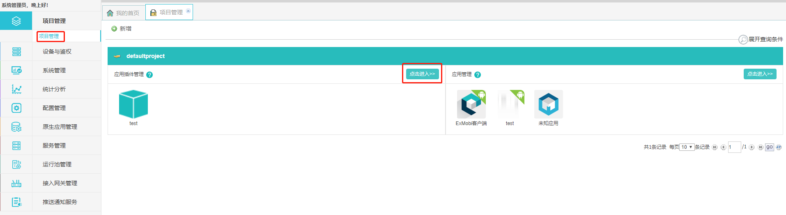

## 1. Exmobi SpringMVC服务搭建

### 1.1 Eclipse如何安装插件

离线安装： 将插件包（[com.xanway.mvctools_1.0.0.201911281115.jar](img/com.xanway.mvctools_1.0.0.201911281115.jar)）拷贝到Eclipse安装目录下的plugins目录中，重启Eclipse。

在线安装：

### 1.2 Mbuilder进行SpringMVC服务开发

#### 1.2.1 创建工程

1. 打开Mbuilder，点击新建MVC工程，填写项目名和包路径


#### 1.2.2 HelloWord服务示例

1. 在controller目录新建类HelloWordController


2. 编辑HelloWordController.java


```java
package com.test.controller;

import java.util.HashMap;
import java.util.Map;

import org.apache.ibatis.annotations.Param;
import org.springframework.stereotype.Controller;
import org.springframework.web.bind.annotation.RequestMapping;

@Controller
public class HelloWordController {
	@RequestMapping("/sayhello")
    @ResponseBody
	public Object sayHello(@Param("content") String content) {
		Map<String, Object> reMap = new HashMap<>();
		reMap.put("time", System.currentTimeMillis());
		reMap.put("conten", content);
		return reMap;
	}
}
```

#### 1.2.3 运行工程


#### 1.2.4 接口访问测试

浏览器打开地址： http://127.0.0.1:8001/test/sayhello?content=hello 


#### 1.2.5 调试代码

1. 设置Mbuilder打开调试模式（窗口->首选项->Exmobi->勾选“在调试模式下启动Exmobi开发模拟器”），重启服务


2. 设置断点并访问接口


#### 1.2.6 导出war包用户Exmobi后台上传服务


## 2. SpringMVC服务开发

### 2.1 目录结构介绍

新建工程的目录结构

```
src
  |---com		代码目录
  |---config.xml	服务参数配置文件，ExMobi管理端会自动读取该路径文件展示参数并支持动态配置
  |---log4j.properties  (可选)日志配置
  |---mvc-config.xml  SpringMVC扫描配置
  |---spring-db.xml  (可选)数据库SpringMVC配置
WebContent      服务根目录
    | --- WEB-INF  整个WEB中最安全的目录，无法直接访问，若访问，需要在web.xml中配置
    |      |-- lib           存放第三方的jar文件
    |      |-- views         存放jsp文件
    |      └-- web.xml  WEB的部署描述文件
    |---   css  (可选)存放所有的*.css文件
    |---   js   (可选)存放所有的*.js文件
    |---   jsp  (可选)存放所有的jsp文件
    |---   index.jsp  (可选)欢迎页面
```

编译后WAR包的目录结构

```
ExMobiService      服务根目录
    | --- WEB-INF  整个WEB中最安全的目录，无法直接访问，若访问，需要在web.xml中配置
    |      |-- classes  保存所有的*.class文件    所有的class都要放在包中
    |      |   |-- config.xml服务参数配置文件，ExMobi管理端会自动读取该路径文件展示参数并支持动态配置
    |      |   |-- api(可选)用于存放API定义文件的目录，使用SpringMVC开发的服务，无需定义该目录及ac文件
    |      |   └-- api.ac(可选)API定义文件，服务端会解析这些文件并展示在API管理中
    |      |-- lib           存放第三方的jar文件
    |      |-- views         存放jsp文件
    |      └-- web.xml  WEB的部署描述文件
    |---   css  (可选)存放所有的*.css文件
    |---   js   (可选)存放所有的*.js文件
    |---   jsp  (可选)存放所有的jsp文件
    |---   index.jsp  (可选)欢迎页面
```


### 2.2 配置文件介绍

 服务参数配置文件（config.xml）ExMobi提供的统一格式的配置文件，开发者在该文件中定义具体业务依赖的配置项，exmobi-business.jar提供了ParamConfig类及参数读取api，支持服务读取相关配置项。config.xml文件中定义的配置信息，会自动在ExMobi管理中展示，并且支持动态修改配置值。 

 config.xml是服务与ExMobi管理端之间的桥梁，通过定义config.xml文件，可以做到参数定义统一配置，简化服务部署。 

config.xml文件示例如下： 

```xml
<?xml version="1.0" encoding="UTF-8"?>
<config>
    <group id="self" name="自定义参数配置">
		<paralist>
			<param>
				<paraKey>bbsdomain</paraKey>
				<paraValue>bbs.exmobi.xanway.com</paraValue>
				<paraName>ExMobi论坛地址</paraName>
				<paraMemo>ExMobi论坛地址</paraMemo>
				<paraRule></paraRule>
			</param>
		</paralist>
	</group>
</config>
```

config.xml文件中主要配置项说明

| Key值            类型   说明                                 |
| ------------------------------------------------------------ |
| groupId         属性   配置项组id                            |
| groupName  属性   配置项组名称                               |
| paraKey        节点  参数key值，该配置项的唯一key值，ParamConfig类需要根据该值获取到paraValue配置值 |
| paraMemo   节点  参数配置示例，用于介绍该配置项的配置示例，ExMobi管理端会读取并显示该值 |
| paraName    节点  参数名称，无特殊用途，ExMobi管理端会读取并显示该值 |
| paraRule       节点  参数值定义正则规则，暂不生效            |
| paraValue     节点  参数value值，ParamConfig类根据该paraKey值获取到的即是该值 |


### 2.3 系统工具包使用示例

SpringMVC示例工程完整包[下载](img/ExMobiService.zip)

#### 2.3.1 登陆EDN获取个人信息

工具包介绍：

​        exmobi-http.jar，HTTP协议操作API能力提供，主要提供支持发送HTTP/HTTPS请求及相应的处理API  

主要API，具体参考[API文档](api/index.html)

| 类                                            | 描述                                             |
| :-------------------------------------------- | :----------------------------------------------- |
| com.xanway.http.HttpUtilBase               | 基于http协议的网络数据获取抽象类                 |
| com.xanway.http.impl.HttpUtil              | 基于http协议的网络数据获取， url进行默认编码处理 |
| com.xanway.http.impl.HttpUtilWithOutEncode | 基于http协议的网络数据获取，url不进行编码处理    |
| com.xanway.http.bean.AttachFile            | 附件封装类                                       |
| com.xanway.http.bean.FormParamter          | 表单封装类                                       |
| com.xanway.http.bean.HttpContext           | WEB请求上下文                                    |
| com.xanway.http.bean.HttpCookie            | Cookie封装类                                     |
| com.xanway.http.bean.HttpHeader            | 请求头封装类                                     |
| com.xanway.http.bean.HttpRequestBean       | 请求信息封装类                                   |
| com.xanway.http.bean.HttpResponseBean      | 响应信息封装类                                   |
| com.xanway.http.bean.ProxyBean             | 代理封装类                                       |

示例：通过用户名登陆EDN，并获取个人信息

```java
package com.xanway.demo.controller.login;

import com.alibaba.fastjson.JSONArray;
import com.alibaba.fastjson.JSONObject;
import com.xanway.business.paramconfig.ParamConfig;
import com.xanway.common.suport.xpath.CachedDom4jXpathProcessImpl;
import com.xanway.common.suport.xpath.IXPathProcess;
import com.xanway.common.util.XmlUtil;
import com.xanway.http.bean.FormParamter;
import com.xanway.http.bean.HttpContext;
import com.xanway.http.bean.HttpHeader;
import com.xanway.http.bean.HttpRequestBean;
import com.xanway.http.bean.HttpResponseBean;
import com.xanway.http.impl.HttpUtil;

import org.apache.log4j.Logger;
import org.dom4j.Document;
import org.springframework.stereotype.Controller;
import org.springframework.web.bind.annotation.RequestMapping;
import org.springframework.web.bind.annotation.RequestParam;
import org.springframework.web.bind.annotation.ResponseBody;

import java.util.ArrayList;
import java.util.List;

import javax.servlet.http.HttpSession;

/**
 * @classname: PathController
 * @author: xw41
 * @date: 2019/11/21 13:23
 * @description:
 */
@Controller
public class LoginController {

    private static final Logger logger = Logger.getLogger(LoginController.class);

    /**
     * 先登陆edn平台再获取登陆用户中心页面显示的个人信息
     * @param session
     * @param username 用户名
     * @param pwd   密码
     * @return  json格式数据
     * @throws Exception
     */
    @ResponseBody
    @RequestMapping("/demo/login")
    public Object login(final HttpSession session, @RequestParam(required = false, value = "username") String username, @RequestParam(required = false, value = "pwd") String pwd) throws Exception {
        //初始构建上下文
        final HttpContext httpContext = new HttpContext();
        httpContext.setContextId(session.getId());
        HttpUtil httpUtil = new HttpUtil(httpContext);
        HttpRequestBean req = new HttpRequestBean();
        //设置url 从config.xml文件中读取 paraKey为 exmobiLogin 的值
        String url = ParamConfig.getValue("exmobiLogin");
        req.setUrl(url);
        req.setEnctype(1);
        //设置请求头
        List<HttpHeader> headers = new ArrayList<HttpHeader>();
        headers.add(new HttpHeader("Content-Type", "application/x-www-form-urlencoded"));
        req.setHeaders(headers);
        //设置Method
        req.setMethod("POST");
        //设置请求参数
        List<FormParamter> params = new ArrayList<FormParamter>();
        params.add(new FormParamter("username", username));
        params.add(new FormParamter("password", pwd));
        req.setFormParams(params);
        //发起请求
        HttpResponseBean rsp = httpUtil.sendHttpRequest(req);
        // 获取响应吗
        int status = rsp.getStatusCode();
        JSONArray articlesArray = new JSONArray();
        if (status == 200) {
            HttpUtil DetailHttpUtil = new HttpUtil(httpContext);
            String detailUrl = ParamConfig.getValue("personalInfo");
            HttpResponseBean detailRsp = DetailHttpUtil.sendGet(detailUrl);
            int detailStatus = detailRsp.getStatusCode();
            if (detailStatus == 200) {
                Document dom = XmlUtil.html2xml(detailRsp.getResponseBody("UTF-8"));
                IXPathProcess ixp = new CachedDom4jXpathProcessImpl();
                JSONObject article = new JSONObject();
                article.put("accountName", ixp.selectNodeValue("//input[@name='account_name']/@value", dom));
                article.put("email", ixp.selectNodeValue("//input[@name='account_spare2']/@value", dom));
                article.put("tel", ixp.selectNodeValue("//input[@name='account_spare1']/@value", dom));
                article.put("trueName", ixp.selectNodeValue("//input[@name='account_name_cn']/@value", dom));
                articlesArray.add(article);
            }
        }
        JSONObject rspJson = new JSONObject();
        rspJson.put("status", status);
        rspJson.put("articles", articlesArray);
        logger.info(rspJson);
        return rspJson;
    }
}
```

配置文件：config.xml

```xml
<group id="self" name="自定义参数配置">
		<paralist>
			<param>
				<paraKey>exmobiLogin</paraKey>
				<paraValue>https://auth.exmobi.xanway.com/login?output=json&amp;random=1573091380627</paraValue>
				<paraName>edn登录</paraName>
				<paraMemo>edn登录</paraMemo>
				<paraRule></paraRule>
			</param>
			<param>
				<paraKey>personalInfo</paraKey>
				<paraValue>https://exmobi.xanway.com/console/consumer.html</paraValue>
				<paraName>个人信息地址</paraName>
				<paraMemo>个人信息地址</paraMemo>
				<paraRule></paraRule>
			</param>
		</paralist>
	</group>
```

#### 2.3.2 ftp文件获取

工具包介绍：

​        exmobi-ftp-6.0.1.jar,  ftp操作API，提供ftp文件的上传、下载等功能

主要API，具体参考[API文档](api/index.html)

| 类                                                 | 描述                    |
| -------------------------------------------------- | ----------------------- |
| com.xanway.ftp.bean.FtpWorkingContextBean       | ftp服务器信息           |
| com.xanway.ftp.impl.DefaultFtpCommunicationImpl | ftp连接建立及操作主要类 |
| com.xanway.ftp.bean.FtpFileDataBean             | ftp操作返回结果         |

示例：通过ftp下载文件

```java
package com.xanway.demo.controller.ftp;

import com.alibaba.fastjson.JSONObject;
import com.xanway.ftp.IFtpCommunication;
import com.xanway.ftp.bean.FtpFileDataBean;
import com.xanway.ftp.bean.FtpWorkingContextBean;
import com.xanway.ftp.impl.DefaultFtpCommunicationImpl;

import org.springframework.stereotype.Controller;
import org.springframework.web.bind.annotation.RequestMapping;
import org.springframework.web.bind.annotation.ResponseBody;

/**
 * @classname: FtpController
 * @author: xw41
 * @date: 2019/11/21 14:09
 * @description:
 */
@Controller
public class FtpController {

    @ResponseBody
    @RequestMapping(value = "/demo/ftpDownload")
    public Object ftpDownload() throws Exception {
        FtpWorkingContextBean ftpWorkingContextBean = new FtpWorkingContextBean();
        //FTP服务器地址,端口,用户名,密码
        ftpWorkingContextBean.setIp("172.16.2.23");
        ftpWorkingContextBean.setPort(21);
        ftpWorkingContextBean.setUsername("ftpuser");
        ftpWorkingContextBean.setPassword("qazwsxedc");
        System.err.println(ftpWorkingContextBean);
        IFtpCommunication ftpCommunication = new DefaultFtpCommunicationImpl(ftpWorkingContextBean);
        //要下载的文件所在的目录
        ftpCommunication.setWorkingDirectory("/home/ftpuser/");
        ftpCommunication.setFtpWorkingContextBean(ftpWorkingContextBean);
        FtpFileDataBean ftpFileDataBean = ftpCommunication.download("aa.xlsx");
        JSONObject rspJson = new JSONObject();
        rspJson.put("path", ftpFileDataBean.getDataFilePath());
        return rspJson;
    }
}
```


#### 2.3.3 文件预览

工具包介绍：

​        exmobi-preview.jar，文档预览API，提供文件转换成HTML或图片相关API 

主要API，具体参考[API文档](api/index.html)

| 类                                           | 描述                                                 |
| -------------------------------------------- | ---------------------------------------------------- |
| com.xanway.preview.FileToHtml             | 文档转换成html，以html形式返回源文档转换后的各个分页 |
| com.xanway.preview.FileToImage            | 文档转换成图片，以图片形式返回源文档转换后的各个分页 |
| com.xanway.preview.bean.DocConvertParam   | 文档转换参数                                         |
| com.xanway.preview.bean.FilePreviewResult | 文档转换结果                                         |
| com.xanway.preview.bean.FileDataBean      | 文件对象                                             |

示例：通过http下载文件并预览

```java
package com.xanway.demo.controller.preview;

import com.alibaba.fastjson.JSONObject;
import com.xanway.business.paramconfig.ParamConfig;
import com.xanway.http.bean.HttpResponseBean;
import com.xanway.http.impl.HttpUtil;
import com.xanway.preview.FileToImage;
import com.xanway.preview.bean.DocConvertParam;
import com.xanway.preview.bean.FilePreviewResult;

import org.apache.commons.io.IOUtils;
import org.springframework.stereotype.Controller;
import org.springframework.ui.Model;
import org.springframework.web.bind.annotation.RequestMapping;
import org.springframework.web.bind.annotation.RequestParam;
import org.springframework.web.bind.annotation.ResponseBody;

import java.io.IOException;
import java.io.InputStream;
import java.io.UnsupportedEncodingException;
import java.net.URLEncoder;

/**
 * @classname: PreviewController
 * @author: xw41
 * @date: 2019/11/21 14:03
 * @description:  调用Exmobi的dcs进行文档转换成图片
 */
@Controller
public class PreviewController {

    /**
     * 文件预览
     * @param pageNum 预览的页数
     * @return
     * @throws Exception
     */
    @ResponseBody
    @RequestMapping(value = "/demo/doPreview")
    public Object doPreview(@RequestParam(required = false, value = "pageNum") Integer pageNum) {
        String dcsAddress = ParamConfig.getValue("dcsServer");
        FileToImage fileToImage = new FileToImage(dcsAddress);
        FilePreviewResult result = null;
        DocConvertParam docConvertParam = new DocConvertParam();
        if (null != pageNum) {
            docConvertParam.setPageNum(pageNum);
        } else {
            docConvertParam.setPageNum(1);
        }
        docConvertParam.setSrcFileExt("doc");
        HttpUtil httpUtil = new HttpUtil();
        String url = null;
        try {
            url = URLEncoder.encode("http://172.16.0.102/samba/test/titan/通用扩展查询，全文检索查询接口说明.doc", "UTF-8");
        } catch (UnsupportedEncodingException e) {
            e.printStackTrace();
        }
        HttpResponseBean rsp = httpUtil.sendGet(url);
        InputStream is = null;
        try {
            is = rsp.getResponseFileInputStream();
            result = fileToImage.convertToJpg(is, docConvertParam);
        } catch (IOException e) {
            e.printStackTrace();
        }finally {
            IOUtils.closeQuietly(is);
        }
        //文档转为图片
        String convertResult = result.getResult();//获取转换结果
        String convertMsg = result.getMsg();//获取转换结果描述信息
        String convertIdentifier = result.getConvertIdentifier();//获取文档转换唯一标识
        String fileMd5 = result.getFileMd5();//获取源文档md5值
        int totalPageNum = result.getTotalPageNum();//获取文档总页数
        int currentPageNum = result.getCurrentPageNum();//获取当前预览页数
        String imgBase64Str = null;
        try {
            imgBase64Str = fileToImage.getPageBase64(result);
        } catch (Exception e) {
            e.printStackTrace();
        }
        JSONObject rspJson = new JSONObject();
        rspJson.put("convertMsg", convertMsg);
        rspJson.put("convertIdentifier", convertIdentifier);
        rspJson.put("fileMd5", fileMd5);
        rspJson.put("totalPageNum", totalPageNum);
        rspJson.put("currentPageNum", currentPageNum);
        rspJson.put("imgBase64Str", imgBase64Str);
        return rspJson;
    }
}

```


#### 2.3.3 消息推送并保存到数据库

工具包介绍：

​		exmobi-db.jar,  数据库操作API能力提供，主要提供数据库的查询，修改及存储过程调用操作API。  

​        exmobi-push.jar,  推送API，主要提供消息推送到终端设备API  

主要API，具体参考[API文档](api/index.html)

| 类                                            | 描述                  |
| --------------------------------------------- | --------------------- |
| com.xanway.push.PnsPushManager             | 推送API，提供推送能力 |
| com.xanway.push.bean.PushMessageRequest    | 推送请求              |
| com.xanway.push.bean.PushMessageResponse   | 推送响应              |
| com.xanway.push.bean.GetPushStatusRequest  | 获取推送状态请求      |
| com.xanway.push.bean.GetPushStatusResponse | 获取推送状态响应      |
| com.xanway.push.bean.DeliveryInformation   | 状态报告体            |
| com.xanway.push.PnsPushManager             | 推送API，提供推送能力 |
| com.xanway.push.bean.PushMessageRequest    | 推送请求              |
| com.xanway.push.bean.PushMessageResponse   | 推送响应              |
| com.xanway.push.bean.GetPushStatusRequest  | 获取推送状态请求      |
| com.xanway.push.bean.GetPushStatusResponse | 获取推送状态响应      |
| com.xanway.push.bean.DeliveryInformation   | 状态报告体            |

示例：给用户发送消息，并把消息保存到数据库

cotroller

```java
package com.xanway.demo.controller.push;

import com.alibaba.fastjson.JSONObject;
import com.xanway.business.paramconfig.ParamConfig;
import com.xanway.push.PnsPushManager;
import com.xanway.push.bean.GetPushStatusRequest;
import com.xanway.push.bean.GetPushStatusResponse;
import com.xanway.push.bean.PushMessageRequest;
import com.xanway.push.bean.PushMessageResponse;
import com.xanway.demo.entity.PushInfo;
import com.xanway.demo.service.PushInfoService;

import org.slf4j.Logger;
import org.slf4j.LoggerFactory;
import org.springframework.stereotype.Controller;
import org.springframework.web.bind.annotation.RequestMapping;
import org.springframework.web.bind.annotation.RequestParam;
import org.springframework.web.bind.annotation.ResponseBody;

import java.util.ArrayList;
import java.util.Date;
import java.util.List;
import java.util.UUID;

import javax.annotation.Resource;

/**
 * @classname: PushController
 * @author: xw41
 * @date: 2019/11/21 14:03
 * @description: 调用Exmobi的推送服务
 */
@Controller
public class PushController {

    private static final Logger logger = LoggerFactory.getLogger(PushController.class);

    @Resource
    private PushInfoService pushInfoService;

    /**
     * @param sender 发送方
     * @param esn    推送的客户端esn
     */
    @RequestMapping(value = "/demo/sendPush")
    @ResponseBody
    public Object sendPush(@RequestParam(required = false, value = "sender") String sender, @RequestParam(required = false, value = "esn") String esn) throws Exception {

        PushMessageRequest pushRequestBean = new PushMessageRequest();
        PnsPushManager pnsPushManager = new PnsPushManager();
        List<String> destAddr = new ArrayList<>();

        destAddr.add(esn == null ? "esn:247189141280922" : "esn:" + esn);
        pnsPushManager.setPnsServiceUrl(ParamConfig.getValue("pnsServer"));
        pushRequestBean.setApplicationId("gaeaclient-android-000004");
        pushRequestBean.setCheckkey("bcs");
        pushRequestBean.setDestAddr(destAddr);
        String msgContent = "{\"titlehead\": \"标题\",\"title\": \"推送消息\",\"page\":\"\"}";
        pushRequestBean.setMsgContent(msgContent);
        pushRequestBean.setTitle("您有新消息");
        pushRequestBean.setType("app");
        String toServerResult = "";
        String toClientResult = "";
        try {
            PushMessageResponse pushMessageResponse = pnsPushManager.pushMessage(pushRequestBean);
            if (null != pushMessageResponse) {
                toServerResult = pushMessageResponse.getResult() + "=======" + pushMessageResponse.getMsg();
            }
            try {
                Thread.sleep(2000);
                GetPushStatusRequest getPushStatusRequestBean = new GetPushStatusRequest();
                // 设置推送标识
                getPushStatusRequestBean.setRequestIdentifier(pushMessageResponse.getRequestIdentifier());
                // 获取推送结果
                GetPushStatusResponse getPushStatusResponseBean = pnsPushManager.getPushStatus(getPushStatusRequestBean);
                toClientResult = getPushStatusResponseBean.getDeliveryStatusList().toString();
                //将推送信息存入mysql数据库
                PushInfo pushInfo = new PushInfo();
                pushInfo.setSender(sender);
                pushInfo.setPushId(UUID.randomUUID().toString());
                pushInfo.setApplicationId("gaeaclient-android-000004");
                pushInfo.setCreatetime(new Date());
                pushInfo.setDestaddr(destAddr.get(0));
                pushInfo.setMsgcontent(msgContent);
                pushInfo.setPushstatus(getPushStatusResponseBean.getDeliveryStatusList().get(0).getResult());
                pushInfoService.insert(pushInfo);
            } catch (Exception e) {
                e.printStackTrace();
            }
        } catch (Exception e) {
            e.printStackTrace();
        }
        JSONObject json = new JSONObject();
        json.put("result", "success");
        json.put("toServerResult", toServerResult);
        json.put("toClientResult", toClientResult);
        return json;
    }
}

```

service

```java
package com.xanway.demo.service.impl;

import com.xanway.demo.dao.PushInfoMapper;
import com.xanway.demo.entity.PushInfo;
import com.xanway.demo.service.PushInfoService;

import org.springframework.stereotype.Service;

import java.util.List;

import javax.annotation.Resource;

@Service
public class PushInfoServiceImpl implements PushInfoService {

    @Resource
    private PushInfoMapper pushInfoMapper;

    @Override
    public int deleteByPrimaryKey(String pushId) {
        return pushInfoMapper.deleteByPrimaryKey(pushId);
    }

    @Override
    public int insert(PushInfo record) {
        return pushInfoMapper.insert(record);
    }

    @Override
    public int insertOrUpdate(PushInfo record) {
        return pushInfoMapper.insertOrUpdate(record);
    }

    @Override
    public int insertOrUpdateSelective(PushInfo record) {
        return pushInfoMapper.insertOrUpdateSelective(record);
    }

    @Override
    public int insertSelective(PushInfo record) {
        return pushInfoMapper.insertSelective(record);
    }

    @Override
    public PushInfo selectByPrimaryKey(String pushId) {
        return pushInfoMapper.selectByPrimaryKey(pushId);
    }

    @Override
    public int updateByPrimaryKeySelective(PushInfo record) {
        return pushInfoMapper.updateByPrimaryKeySelective(record);
    }

    @Override
    public int updateByPrimaryKey(PushInfo record) {
        return pushInfoMapper.updateByPrimaryKey(record);
    }

    @Override
    public int updateBatch(List<PushInfo> list) {
        return pushInfoMapper.updateBatch(list);
    }

    @Override
    public int batchInsert(List<PushInfo> list) {
        return pushInfoMapper.batchInsert(list);
    }

}
```

dao

```java
package com.xanway.demo.dao;

import com.xanway.demo.entity.PushInfo;
import java.util.List;
import org.apache.ibatis.annotations.Param;

public interface PushInfoMapper {
    int deleteByPrimaryKey(String pushId);
    int insert(PushInfo record);
    int insertOrUpdate(PushInfo record);
    int insertOrUpdateSelective(PushInfo record);
    int insertSelective(PushInfo record);
    PushInfo selectByPrimaryKey(String pushId);
    int updateByPrimaryKeySelective(PushInfo record);
    int updateByPrimaryKey(PushInfo record);
    int updateBatch(List<PushInfo> list);
    int batchInsert(@Param("list") List<PushInfo> list);
}
```

配置文件: config.xml

```xml
<group id="DB" name="数据库参数配置">
		<paralist>
			<param>
				<paraKey>driverClass</paraKey>
				<paraValue>com.mysql.jdbc.Driver</paraValue>
				<paraName>数据库连接池驱动</paraName>
				<paraMemo>数据库连接池驱动，配置后需重启服务</paraMemo>
				<paraRule></paraRule>
			</param>
			<param>
				<paraKey>jdbcUrl</paraKey>
				<paraValue>jdbc:mysql://172.16.0.34:3306/jxydemo</paraValue>
				<paraName>数据库连接池URL</paraName>
				<paraMemo>数据库连接池URL，配置后需重启服务</paraMemo>
				<paraRule></paraRule>
			</param>
			<param>
				<paraKey>user</paraKey>
				<paraValue>root</paraValue>
				<paraName>数据库连接池用户</paraName>
				<paraMemo>数据库连接池用户，配置后需重启服务</paraMemo>
				<paraRule></paraRule>
			</param>
			<param>
				<paraKey>password</paraKey>
				<paraValue>2011</paraValue>
				<paraName>数据库密码</paraName>
				<paraMemo>数据库密码</paraMemo>
				<paraRule></paraRule>
			</param>
			<param>
				<paraKey>minPoolSize</paraKey>
				<paraValue>1</paraValue>
				<paraName>数据库连接池最小连接数</paraName>
				<paraMemo>数据库连接池最小连接数，配置后需重启服务</paraMemo>
				<paraRule></paraRule>
			</param>
			<param>
				<paraKey>maxPoolSize</paraKey>
				<paraValue>30</paraValue>
				<paraName>数据库连接池最大连接数</paraName>
				<paraMemo>数据库连接池最大连接数，配置后需重启服务</paraMemo>
				<paraRule></paraRule>
			</param>
			<param>
				<paraKey>initialPoolSize</paraKey>
				<paraValue>10</paraValue>
				<paraName>数据库连接池初始连接数</paraName>
				<paraMemo>数据库连接池初始连接数，配置后需重启服务</paraMemo>
				<paraRule></paraRule>
			</param>
			<param>
				<paraKey>preferredTestQuery</paraKey>
				<paraValue>select 1</paraValue>
				<paraName>心跳sql</paraName>
				<paraMemo>心跳sql，配置后需重启服务</paraMemo>
				<paraRule></paraRule>
			</param>
		</paralist>
</group>
<group id="self" name="自定义参数配置">
		<paralist>
			
				<paraKey>pnsServer</paraKey>
				<paraValue>http://172.16.2.16:8001/services/pnsService</paraValue>
				<paraName>pns引擎地址</paraName>
				<paraMemo>pns引擎地址</paraMemo>
				<paraRule></paraRule>
			</param>
		</paralist>
</group>
```

Spring数据库配置:  spring-db.xml

```xml
<?xml version="1.0" encoding="UTF-8"?>
<beans xmlns="http://www.springframework.org/schema/beans"
	xmlns:xsi="http://www.w3.org/2001/XMLSchema-instance" xmlns:mvc="http://www.springframework.org/schema/mvc"
	xmlns:context="http://www.springframework.org/schema/context"
	xsi:schemaLocation="http://www.springframework.org/schema/mvc http://www.springframework.org/schema/mvc/spring-mvc.xsd
		http://www.springframework.org/schema/beans http://www.springframework.org/schema/beans/spring-beans.xsd
		http://www.springframework.org/schema/context http://www.springframework.org/schema/context/spring-context.xsd">
<!-- 引入config.xml配置文件,使用${aa} 取到对应paraKey为aa的paraValue值,list标签中可放多个配置文件bean-->
<bean id="propertyConfigurer" class="org.springframework.beans.factory.config.PropertyPlaceholderConfigurer">
	<property name="propertiesArray">
		<list>
			<bean id="xmlConfig" class="com.xanway.spring.yaml.YamlPropertiesFactoryFhBean"/>
		</list>
	</property>
</bean>

 <!-- (事务管理)transaction manager, use JtaTransactionManager for global tx -->  
 <bean id="transactionManager"  
     class="org.springframework.jdbc.datasource.DataSourceTransactionManager">  
     <property name="dataSource" ref="dataSource" />
 </bean>

	<bean id="sqlSessionFactory" class="org.mybatis.spring.SqlSessionFactoryBean">
		<property name="dataSource" ref="dataSource" />
		<!-- 自动扫描mapping.xml文件 -->
		<property name="mapperLocations" value="classpath:com/xanway/demo/dao/mapper/*.xml"/>
	</bean>

	<!-- DAO接口所在包名，Spring会自动查找其下的类 -->
	<bean class="org.mybatis.spring.mapper.MapperScannerConfigurer">
		<property name="basePackage" value="com.xanway.demo.dao" />
		<property name="sqlSessionFactoryBeanName" value="sqlSessionFactory"/>
	</bean>
	<!--druid连接池-->
	<bean id="dataSource" class="com.alibaba.druid.pool.DruidDataSource"
		  init-method="init" destroy-method="close">
		<property name="driverClassName" value="${driverClass}" />
		<property name="url" value="${jdbcUrl}" />
		<property name="username" value="${username}" />
		<property name="password" value="${password}" />
		<!-- 配置初始化大小、最小、最大 -->
		<property name="initialSize" value="${initialPoolSize}" />
		<property name="minIdle" value="${minPoolSize}" />
		<property name="maxActive" value="${maxPoolSize}" />
		<!-- 配置获取连接等待超时的时间 -->
		<property name="maxWait" value="10000" />
		<!-- 配置间隔多久才进行一次检测，检测需要关闭的空闲连接，单位是毫秒 -->
		<property name="timeBetweenEvictionRunsMillis" value="60000" />
		<!-- 配置一个连接在池中最小生存的时间，单位是毫秒 -->
		<property name="minEvictableIdleTimeMillis" value="300000" />
		<property name="testWhileIdle" value="true" />
		<!-- 这里建议配置为TRUE，防止取到的连接不可用 -->
		<property name="testOnBorrow" value="true" />
		<property name="testOnReturn" value="false" />
		<!-- 打开PSCache，并且指定每个连接上PSCache的大小 -->
		<property name="poolPreparedStatements" value="true" />
		<property name="maxPoolPreparedStatementPerConnectionSize"
				  value="20" />
		<!-- 验证连接有效与否的SQL，不同的数据配置不同 -->
		<property name="validationQuery" value="select 1 " />
		<property name="filters" value="stat" />
		<property name="proxyFilters">
			<list>
				<ref bean="logFilter" />
			</list>
		</property>
	</bean>

	<bean id="logFilter" class="com.alibaba.druid.filter.logging.Slf4jLogFilter">
		<property name="statementExecutableSqlLogEnable" value="false" />
	</bean>
</beans>  
```


## 3. SpringMVC服务发布

### 3.1 导出war包

点击导出war包图标，选择项目及war包路径，点击完成导出war包


### 3.2 上传war包

将SpringMVC服务上传到Exmobi后台

1. 点击服务管理，然后点击“+”号


2. 填写服务信息，服务标识、名称、版本还和开发者，上传war包和LOGO并点击保存


3. 服务上传成功


### 3.3 容器管理

容器是用来运行SpringMVC服务的，容器管理主要提供容器新增、启动、停止和删除

1. 点击“运行容器管理”，选择需要新增容器的运行池，点击“新增”


2. 填写容器名称、http端口、https端口以及内存，并点击确定，容器新增成功


### 3.4 服务配置管理

​		SpringMVC服务测试环境和生产环境的配置是不一样的，例如测试环境连接的数据库和生产环境的连接的数据库是不同的，服务配置管理修改相关配置，而不需要通过war中的配置文件来达到相关目标。

1. 点击“服务管理”，点击需要进行参数配置的服务，点击参数配置


2. 根据实际情况进行参数配置

3. 点击“保存参数”进行参数保存， 点击“同步参数”将配置同步到在容器中允许的服务

### 3.5 服务下发到容器

服务下发到容器是指将SpringMVC部署到相关容器中并运行，从而对客户端提供相关服务能力。

1. 点击“服务管理”，点击需要管理的服务，点击“所在容器”， 选择容器下发


2. 选择服务需要运行在哪个容器中，点击确定将服务下发到相关容器中

### 3.6 测试授权码申请

授权码用于客户端请求的鉴权工作，防止SpringMVC服务端接口被非法调用

1. 点击“访问码管理”，点击“新增开发访问码”，选择测试授权能够访问的服务，点击“确定”


2. 授权码保存成功，该授权码可以用于接口API测试已经客户端开发服务调用

### 3.7 正式授权码申请

授权码用于客户端请求的鉴权工作，防止SpringMVC服务端接口被非法调用

点击“访问码管理”，点击“新增正式访问码”，选择测试授权能够访问的服务并填写客户端标识，点击“保存”，正式授权码申请成功


### 3.8 接口API测试

测试SpringMVC服务接口是否能够正常工作

1. 点击服务管理，点击需要进行接口API测试的服务，点击“服务API管理”


2. access_token填写刚刚申请的测试授权码，其他参数根据业务需求进行参数填写

3. 点击发送，则在响应区域会显示接口返回的数据


## 4. 客户端开发

### 4.1 exmobi开发

客户端示例代码完整包[下载](img/exmobi_service_client.zip)

#### 4.1.1 全局环境变量定义及微服务鉴权工具类AccessAuthUtil使用示例

对全局使用的环境变量进行统一定义，方便维护和全局调用，同时对微服务鉴权工具类 (AccessAuthUtil)进行封装便于快捷调用。

例如示例tokensdk文件，开发者在实际开发过程中可根据自身需求进行自定义封装；授权码申请参考3.7章节

```javascript
/**
 * 平台接入封装
 * accessCode：访问接入授权码  【注：开发者请替换成自己的访问码，在后台管理页面可以进行正式授权码申请，所填写应用ID需要和本插件应用ID一致】
 * serverUrl：平台接入服务端http协议接入地址【注：开发者请替换成自己搭建的平台http协议访问地址】
 * serverUrl_https：平台接入服务端https协议接入地址【注：开发者请替换成自己搭建的平台https协议访问地址】
 * init：SDK初始化
 * exec：SDK获取token，并执行回调方法同时传递token值
 */
var tokensdk = {
	"accessCode" : "79a1a358-552b-4e70-b875-2e7fc7547cb7",
	"serverUrl" : "http://172.16.2.23:8001",
	init : function() {
		//该方法为SDK初始化操作
		var jsonData = {};
		jsonData.accessCode = this.accessCode;
		AccessAuthUtil.init(jsonData);
	},
	exec : function (func) {
		//调用初始化
		if (!this.isinit) {
			this.init();
			this.isinit = true;
		}
		//获取访问码，调用回调方法
		var jsonData = {};
		jsonData.url = this.serverUrl + "/api/getAccessToken";
		AccessAuthUtil.getToken(jsonData, func);
	}
};
```

#### 4.1.2 登陆并展示给人信息接口调用

```html
<html>
	<head>
		<meta content="charset=utf-8"/>
		<title>Hello World</title>
		<script type="text/javascript" src="res:script/tokensdk.js"></script>
		<script>
		<![CDATA[
			function doLogin(json){
				var username = document.getElementById("username").value;
				var pwd = document.getElementById("pwd").value;
	            var ajaxData = {};
				ajaxData.data = "username="+username+"&pwd="+pwd;
			    ajaxData.isBlock = true;
			    ajaxData.method = "GET";
                //调用SpringMVC服务进行登录获取用户信息
			    ajaxData.url = tokensdk.serviceUrl + "/demo/login?access_token="+json.token;
			    ajaxData.successFunction = "doLoginSuc";
			    ajaxData.failFunction = "failFun";
			    var ajax = new DirectAjax(ajaxData);
	            ajax.send();
			}
			
			function doLoginSuc(data){
				var rsptext = ClientUtil.stringToJson(data.responseText);
				var accountName = rsptext.articles[0].accountName;
				var email = rsptext.articles[0].email;
				var tel = rsptext.articles[0].tel;
				var trueName = rsptext.articles[0].trueName;
				window.open("res:page/user.uixml?accountName="+accountName+"&email="+email+"&tel="+tel+"&trueName="+trueName);
			}
		</script>
	</head>
	<body>
		 <input type="text" prompt="用户名" hideborder="true" id="username" value=""/>
         <input type="password" prompt="密码" hideborder="true" id="pwd" value=""/>
         <input type="button" value="登录" onclick="tokensdk.exec(doLogin)"></input>
	</body>
</html>
```

#### 4.1.3 文件预览

```html
<!-- ExMobi UIXML(XHTML)文件 -->
<html>
	<head>
		<meta content="charset=utf-8"/>
		<title>Hello World</title>
		<script type="text/javascript" src="res:script/tokensdk.js"></script>
		<script>
		<![CDATA[
			
			var totalPage = parseInt(window.getParameter("totalPage"));
			var currentPage = parseInt(window.getParameter("currentPage"));

			function init(){
				var img = window.getStringSession("img");
				document.getElementById("imgId").src = "data:image/jpeg;base64,"+img;
			}
			function previousPage(){
				if(currentPage == 1){
					alert("已经是第一页");
				}else{
					currentPage -= 1;
					tokensdk.exec(changeImg);
				}
			}
			function nextPage(){
				if(currentPage == totalPage){
					alert("已经是最后一页");
				}else{
					currentPage += 1;
					tokensdk.exec(changeImg);
				}
			}
			
			function changeImg(json){
				var pageNum = currentPage;
				var ajaxData = {};      
				ajaxData.data = "pageNum="+pageNum;
			    ajaxData.isBlock = true; 
			    ajaxData.method = "GET";
			    ajaxData.url = tokensdk.serviceUrl + "/demo/doPreview?access_token="+json.token;
			    ajaxData.successFunction = "changeImgSuc";
			    ajaxData.failFunction = "failFun";
			    var ajax = new DirectAjax(ajaxData);
	            ajax.send();
			}
			
			function changeImgSuc(data){
				var rsptext = ClientUtil.stringToJson(data.responseText);
				var img = rsptext.imgBase64Str;
				currentPage = rsptext.currentPageNum;
				document.getElementById("imgId").src = "data:image/jpeg;base64,"+img;
			}
			
			function failFun(){
				alert("fail");
			}
		]]>
		</script>
	</head>
	<body onload="init()">
		</img>
		<input type="button" value="上一页" onclick="previousPage()"></input>
		<input type="button" value="下一页" onclick="nextPage()"></input>
	</body>
</html>
```


#### 4.1.4 消息推送并保存消息到数据库接口调用

```html
<html>
	<head>
		<meta content="charset=utf-8"/>
		<title>Hello World</title>
		<script type="text/javascript" src="res:script/tokensdk.js"></script>
		<script>
		<![CDATA[
			function doPush(json){
				var esn = DeviceUtil.getEsn();
				var ajaxData = {};
				ajaxData.data = "esn="+esn;
			    ajaxData.isBlock = true;
			    ajaxData.method = "GET";
                // 调用服务端接口进行消息推送
			    ajaxData.url = tokensdk.serviceUrl + "/demo/sendPush?access_token="+json.token;
			    ajaxData.successFunction = "doPushSuc";
			    ajaxData.failFunction = "failFun";
			    var ajax = new DirectAjax(ajaxData);
	            ajax.send();
			}
			
			function doPushSuc(data){
				var rsptext = ClientUtil.stringToJson(data.responseText);
				alert(rsptext.result);
			}
		</script>
	</head>
	<body>
		 <input type="text" prompt="用户名" hideborder="true" id="username" value=""/>
         <input type="password" prompt="密码" hideborder="true" id="pwd" value=""/>
         <input type="button" value="登录" onclick="tokensdk.exec(doLogin)"></input>
	</body>
</html>
```


## 5. 应用发布

### 5.1exmobi插件发布

1. 导出插件



2. 上传插件




填写应用信息点击确认后，应用上传成功。通过基座或者edn打包的客户端可以打开exmobi应用进行应用使用。


